# Proje İyileştirme Raporu ve Grafik Rehberi

Bu rapor, projenizdeki verileri anlamlandırmanız için üretilen **25 adet geliştirilmiş grafiği** ve yorumlarını içerir. Tüm grafikler profesyonel "darkgrid" temasıyla güncellendi.

## 1. Veri Dağılımı (Genel Bakış)
Veri setinizdeki hedef ve ana değişkenlerin genel durumunu gösterir.

### 1. Risk Sınıf Dağılımı
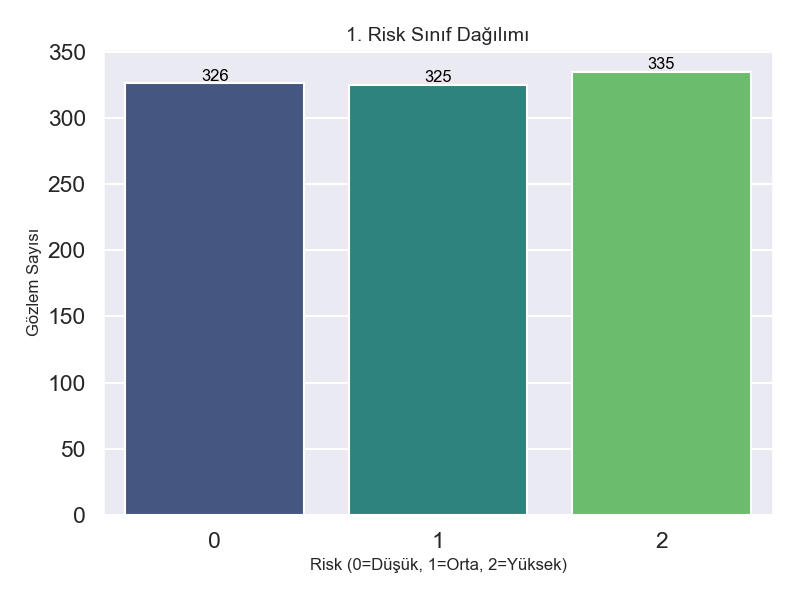
> **Yorum:** Veri setinizde dengesizlik var. Çoğu örnek "Yüksek Risk" (2) ve "Orta Risk" (1) grubunda. "Düşük Risk" (0) örnek sayısı çok az. Modelin düşük riski öğrenmesi zor olabilir.

---

## 2. OHLC (Açılış, Yüksek, Düşük, Kapanış, Hacim) Dağılımları
Fiyat verilerinin nasıl dağıldığını gösterir.

### 2. Open (Açılış) - 6. Volume (Hacim)

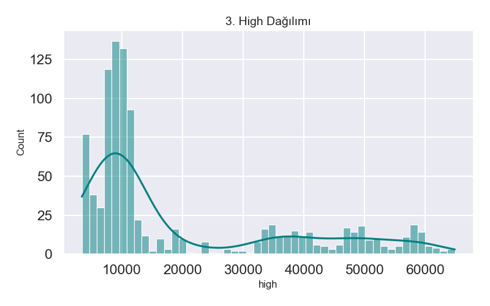
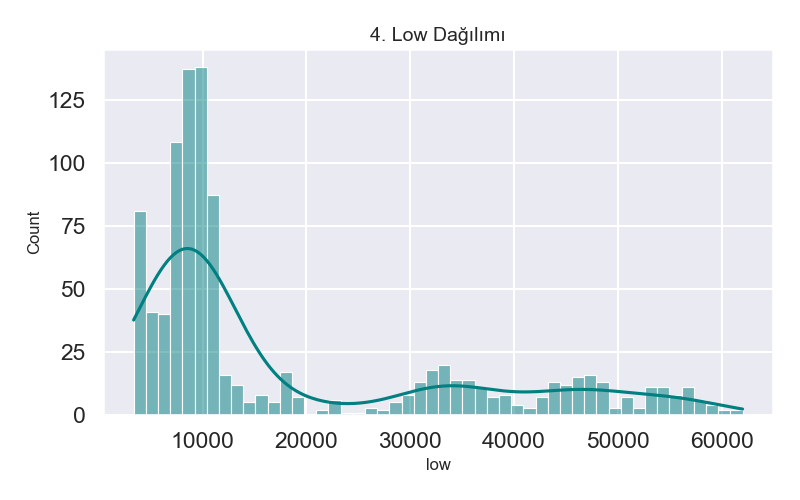
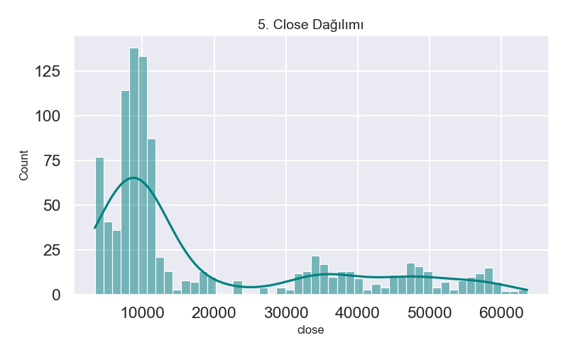
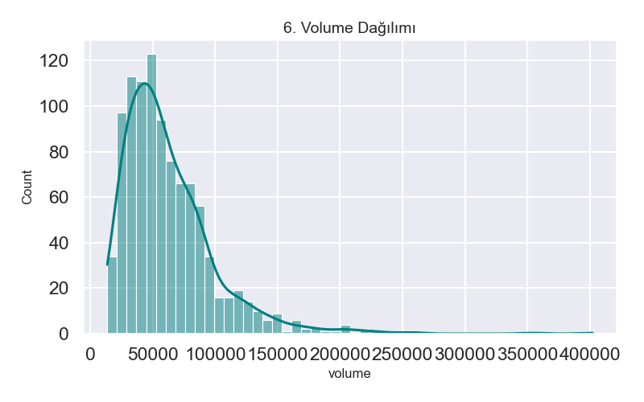

> **Yorum:**
> - Fiyatlar (Open, High, Low, Close) genellikle benzer dağılım gösterir (sağa çarpık olabilir). Bu normaldir.
> - **Volume (Hacim):** Genelde log-normal dağılır. Çok yüksek hacimli günler "outlier" (aykırı değer) olabilir ve önemli piyasa hareketlerini işaret eder.

---

## 3. Türetilmiş Özellik Dağılımları
Hesaplanan feature'ların (Return, Volatility vb.) dağılımı.

### 7. Return (Getiri) - 10. Body (Gövde)
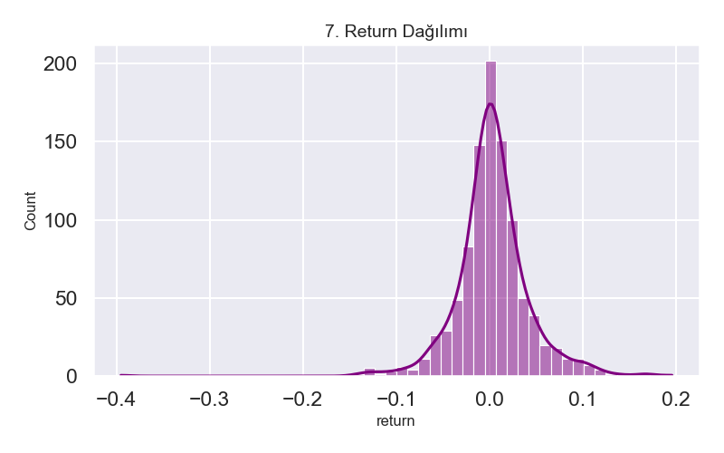
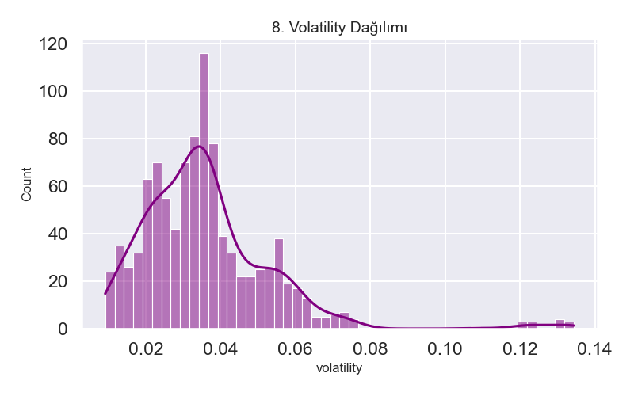

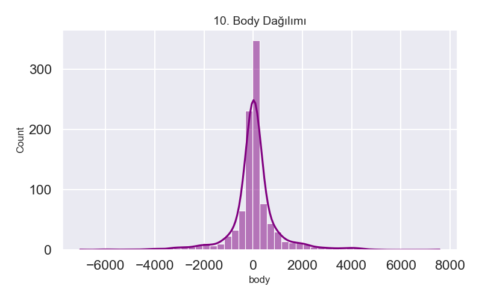

> **Yorum:**
> - **Return:** Sıfır etrafında çan eğrisi (Normal dağılım) oluşturması beklenir. Kuyrukların uzunluğu risk iştahını gösterir.
> - **Volatility:** Genelde sağa çarpıktır. Yüksek volatilite yüksek risk demektir.

---

## 4. Risk Gruplarına Göre OHLC Analizi (Boxplot)
Fiyatların risk gruplarına göre nasıl değiştiğini gösterir.

### 11. Open - 15. Volume
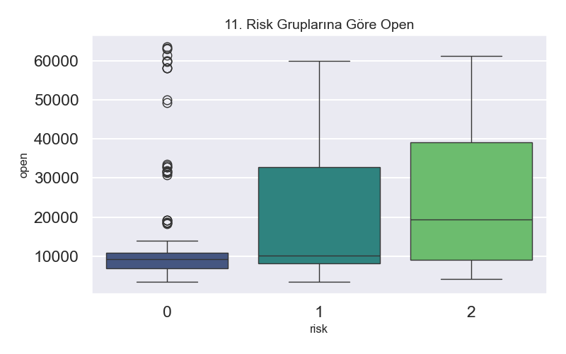
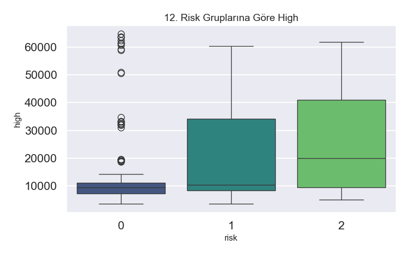
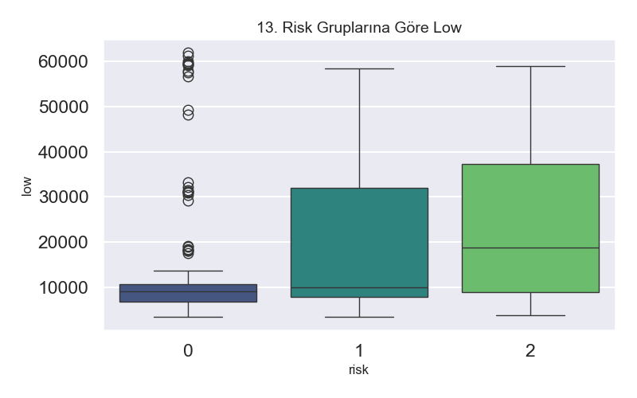
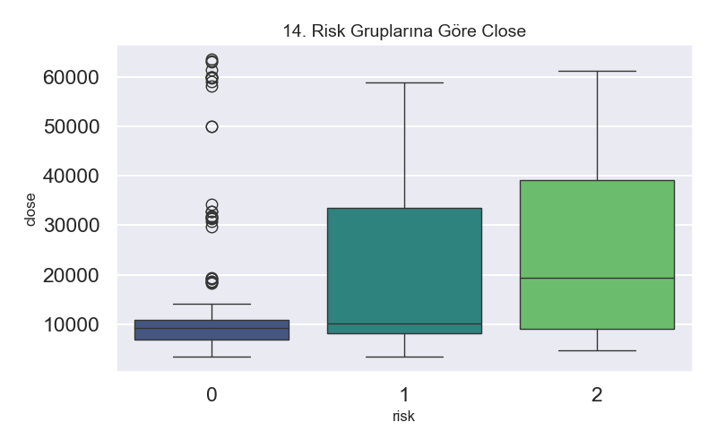
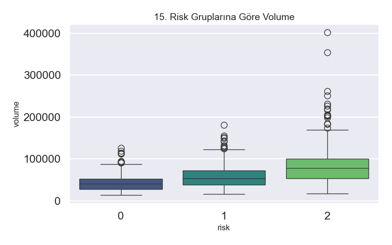

> **Yorum:**
> - Kutuların (box) boyutu ve "çizgilerin" (whisker) uzunluğu o risk grubundaki değişkenliği gösterir.
> - Eğer bir risk grubunda kutu çok daha yukarıdaysa, o risk seviyesinde fiyat/hacim daha yüksek demektir.

---

## 5. Risk Gruplarına Göre Türetilmiş Özellikler (Boxplot)
**En önemli analizler buradadır.** Risk ile doğrudan ilişkili özellikleri gösterir.

### 16. Return - 19. Body
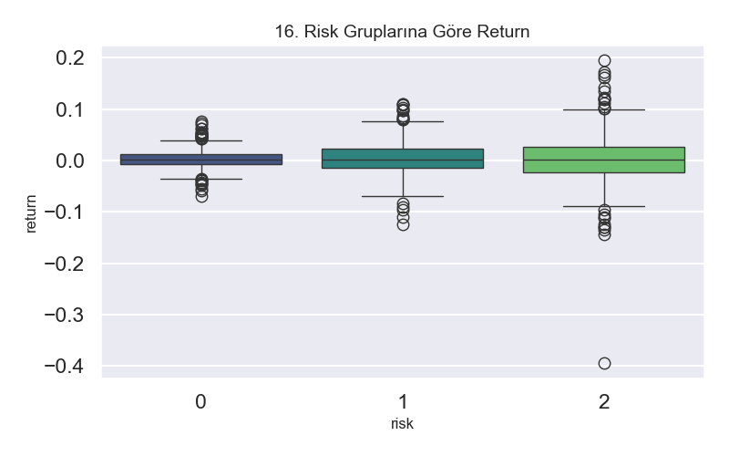
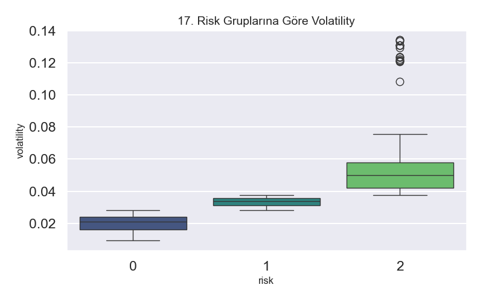
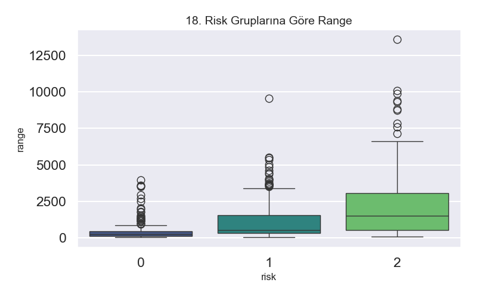
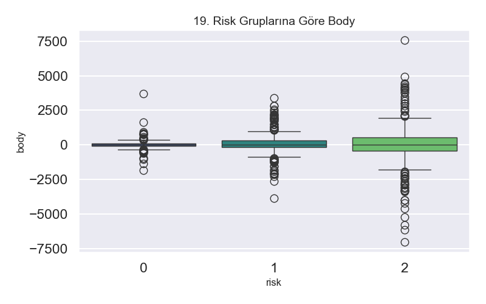

> **Yorum:**
> - **Volatility vs Risk:** Yüksek risk grubunda (2), Volatility kutusunun çok daha yukarıda olmasını beklersiniz. Zaten etiketleme buna göre yapıldıysa bu bir doğrulama grafiğidir.
> - **Range (Yüksek-Düşük farkı):** Yüksek riskli günlerde fiyat aralığının (Range) daha geniş olması beklenir.

---

## 6. İlişkiler ve Zaman Serisi

### 20. Korelasyon Matrisi

> **Yorum:** Değişkenlerin birbirleri ile ilişkisi.
> - Kırmızı (1.0): Pozitif güçlü ilişki.
> - Mavi (-1.0): Negatif güçlü ilişki.
> - **Önemli:** `Risk` satırına bakın. En yüksek korelasyon hangi özellik ile? (Muhtemelen Volatility).

### 21. Fiyat ve 22. Volatilite Zaman Serisi
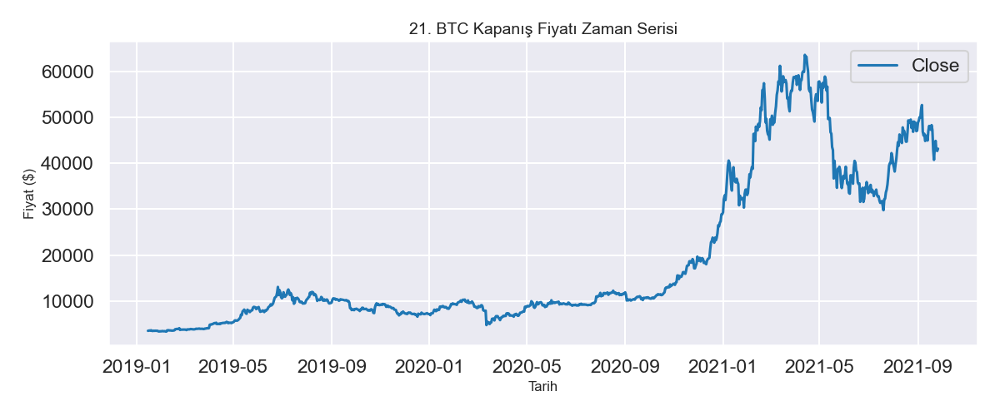
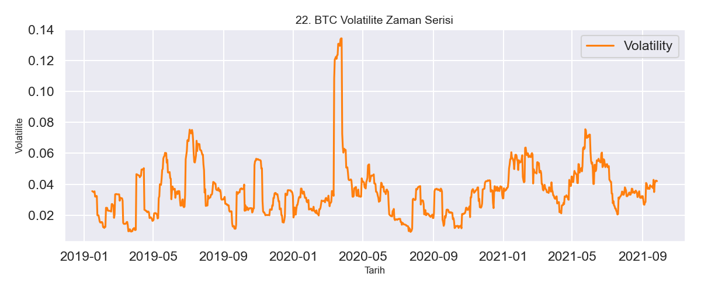

> **Yorum:**
> - Fiyatın zamanla değişimi.
> - Volatilitenin arttığı dönemler (turuncu grafik tepeler), riskli dönemlerdir.

### 23. Getiri vs Volatilite (Scatter)
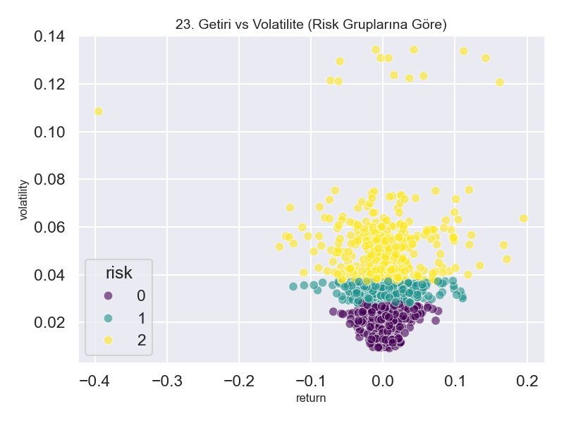
> **Yorum:**
> - Yatay eksen getiri, dikey eksen volatilite.
> - Renkler risk grubunu gösterir. Sarı noktaların (Yüksek Risk) genellikle grafiğin üst kısmında toplanması gerekir.

---

## 7. Veri Kalitesi

### 24. Eksik Veri (Bar) ve 25. Matris
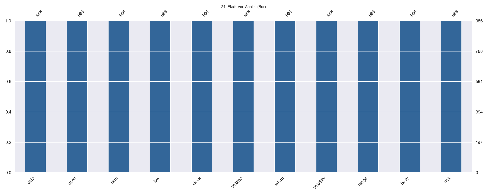
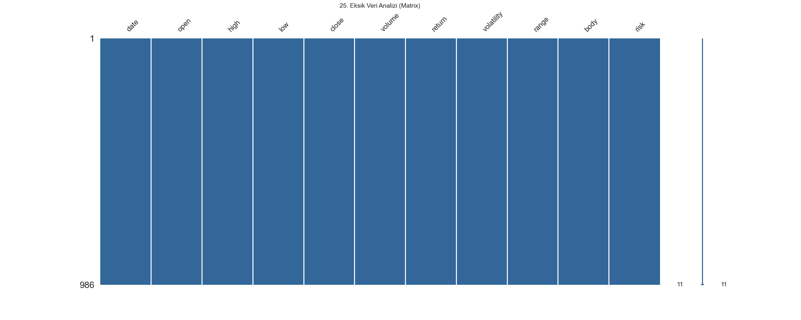

> **Yorum:**
> - Eğer çubuklar tam doluysa (en üst seviyede), verinizde eksik yok demektir.
> - Beyaz çizgiler eksik verileri temsil eder.

---

## Model Sonuçları
Mevcut modelinizin performansı:
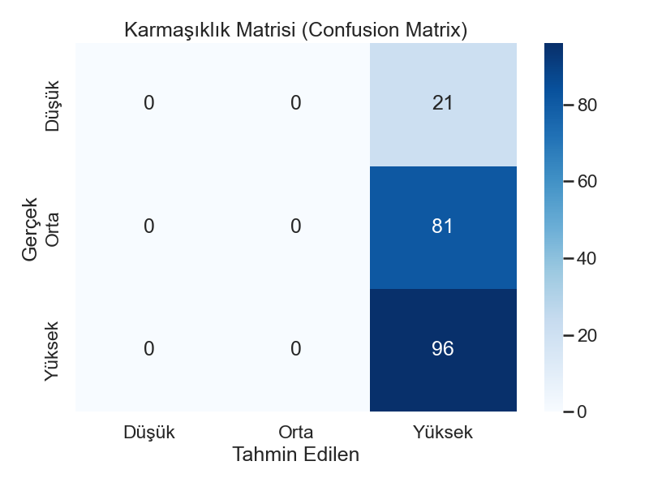
> Model ağırlıklı olarak "Yüksek Risk" tahmin ediyor. Veri dengeleme çalışması yapılması önerilir.
